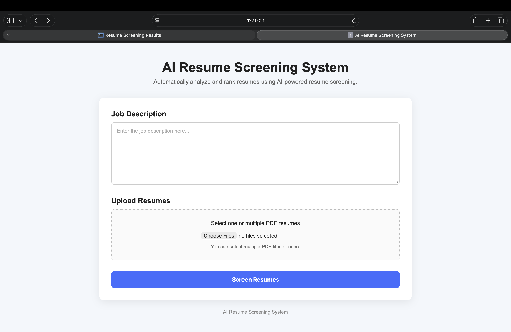
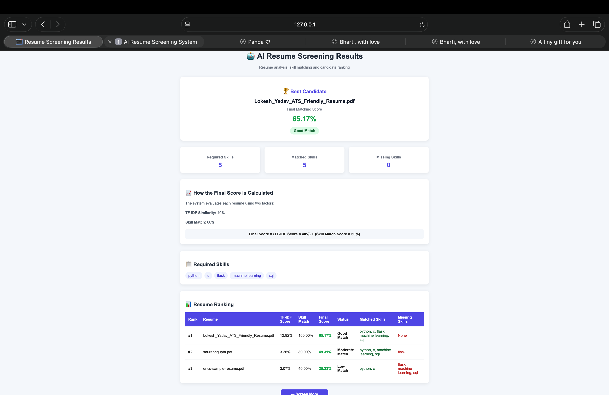

# AI Resume Screening System

An AI-based resume screening system that analyzes multiple PDF resumes against a given job description and ranks candidates based on their relevance.

## Features

* Upload multiple PDF resumes
* Enter a job description
* Extract text from PDF resumes
* Preprocess text using NLP
* Calculate resume similarity using TF-IDF
* Match required skills with resume skills
* Calculate an overall candidate score
* Rank candidates automatically
* Display matched and missing skills
* Show candidate match status

## Technologies Used

* Python
* Flask
* NLTK
* Scikit-learn
* PyPDF2
* HTML
* CSS

## How It Works

1. The user enters a job description.

2. The user uploads multiple PDF resumes.

3. Flask receives the job description and resumes.

4. Text is extracted from each PDF using PyPDF2.

5. NLTK preprocesses the text by:

   * Converting text to lowercase
   * Removing stop words
   * Removing punctuation
   * Applying lemmatization

6. TF-IDF and cosine similarity are used to calculate resume relevance.

7. Required skills are extracted from the job description.

8. The system checks which required skills are present in each resume.

9. The final score is calculated using:

   **Final Score = (TF-IDF Score × 40%) + (Skill Match Score × 60%)**

10. Candidates are ranked according to their final score.

11. The results are displayed on a web page.

## Project Structure

```text
AI-Resume-Screening/
│
├── app.py
├── resume_screening.py
├── requirements.txt
├── README.md
│
├── templates/
│   ├── index.html
│   └── result.html
│
└── static/
    └── style.css
```

## Installation

Clone the repository:

```bash
git clone YOUR_GITHUB_REPOSITORY_URL
```

Go to the project directory:

```bash
cd AI-Resume-Screening
```

Install the required libraries:

```bash
pip install -r requirements.txt
```

Download the required NLTK data:

```python
import nltk

nltk.download('punkt')
nltk.download('stopwords')
nltk.download('wordnet')
```

## Run the Application

Start the Flask application:

```bash
python app.py
```

Then open the URL shown in the terminal, usually:

```text
http://127.0.0.1:5000/
```

## Scoring System

The system uses two main factors:

| Component         |   Weight |
| ----------------- | -------: |
| TF-IDF Similarity |      40% |
| Skill Matching    |      60% |
| **Total**         | **100%** |

The candidates are ranked based on their final score.

## Example

A job description may require:

```text
Python, Machine Learning, SQL, Flask
```

If a resume contains:

```text
Python, Machine Learning, SQL
```

the system identifies the matched and missing skills and calculates the candidate's overall score.

## Future Improvements

* Add more skills to the skill database
* Improve skill extraction using NLP
* Support additional resume formats
* Add database storage
* Add authentication
* Improve candidate filtering
* Deploy the application online

## Screenshots

### Home Page



### Results Page



## Author

**Lokesh Yadav**

B.Tech Computer Science Engineering
